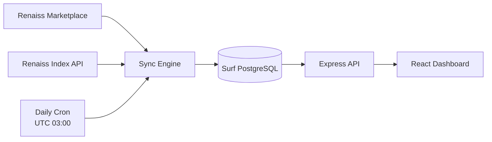

<div align="center">

# ◈ Renaiss Market v2

### Renaiss Marketplace × Renaiss Index 的卡牌套利监控台

<p>
  
  
  
  
</p>

<p>
  实时读取 Renaiss 当前挂牌价，结合 Renaiss Index 的 <code>priceUsdCents</code> 与 <code>confidence</code>，筛选潜在套利机会。
</p>

</div>

---

## ✨ 项目亮点

| 能力 | 说明 |
| --- | --- |
| **真实挂牌价** | 从 Renaiss Marketplace 获取当前 listed 卡牌与 `askPriceInUSDT` |
| **Index 估值** | 优先通过证书号查询 `/v1/graded/{cert}`，失败时再进行受约束的名称搜索 |
| **套利计算** | 同时展示 Index 价格、美元价差和 ROI |
| **数据质量保护** | fallback 匹配强制校验评级公司、等级和卡号，避免 PSA / CGC 错配 |
| **稳定同步** | 分页、限速、超时、429 / 5xx 重试、单卡失败隔离 |
| **每日更新** | 由运行平台 Cron 每天 UTC 03:00 自动同步 |
| **安全设计** | API Key / Secret 只存在后端；手动同步接口默认关闭 |

> 当前版本以 Pokémon 卡牌为主要范围，Index fallback 搜索默认使用 `game=pokemon`。

## 📐 价格与套利定义

所有金额均为 USD。

| 指标 | 计算方式 |
| --- | --- |
| Renaiss 挂牌价 | `askPriceInUSDT / 1e18` |
| Index 参考价 | `priceUsdCents / 100` |
| 价差 | `Index 参考价 - Renaiss 挂牌价` |
| ROI | `价差 / Renaiss 挂牌价 × 100%` |
| 套利候选 | 同时存在有效挂牌价和 Index 价格，且价差为正 |

### Index 匹配优先级

```text
证书号精确查询
       ↓ 失败或无价格
卡号 + 名称 + 语言搜索
       ↓
评级公司与等级一致性校验
       ↓
写入 renaissos_prices
```

不同评级不会互相替代：

```text
CGC 8.5  ✕  PSA 10
PSA 10   ✓  PSA 10
```

## 🧭 系统架构



### 数据流

1. Marketplace 分页拉取当前挂牌卡牌。
2. 从卡牌名称或图片 URL 中识别评级公司与证书号。
3. 优先请求 Renaiss Index 的证书接口。
4. 证书接口无可用价格时，使用受约束的 `/v1/search` fallback。
5. 计算价差与 ROI，并写入 Surf PostgreSQL。
6. 前端通过项目 API 读取聚合结果，不接触 Index Secret。

## 🖥️ 页面展示

Dashboard 当前展示：

- 已挂牌卡牌数量
- 挂牌总价值
- 已获得 Index 价格的卡牌数量
- 套利候选数量
- Renaiss 挂牌价
- Index `priceUsdCents` 与美元换算价
- 价差与 ROI
- Index `confidence`
- 最近成交 / 更新时间
- Renaiss 链接与 Index 链接

支持：

- 名称、Token ID、Serial 搜索
- `prime / high / medium / low` 置信度筛选
- 只查看正价差套利候选
- 分页浏览

## 🗂️ 项目结构

```text
.
├── backend/
│   ├── db/schema.js              # 数据表定义
│   ├── lib/app.js                # Marketplace、Index 与同步核心逻辑
│   ├── routes/market.js          # 市场查询 API
│   ├── routes/sync.js            # 同步状态与手动同步 API
│   ├── scripts/check-env.js      # 后端环境变量检查
│   └── server.js                 # Express + Surf SDK 服务入口
├── frontend/
│   ├── src/App.tsx               # 套利监控页面
│   ├── src/index.css             # 全局样式
│   ├── scripts/check-env.cjs     # 前端环境变量检查
│   └── vite.config.ts            # Vite 与 API proxy 配置
├── cron/
│   └── daily-sync.js             # 每日同步任务
├── cron.json                     # Cron 调度配置
└── README.md
```

## 🚀 快速开始

### 1. 准备环境

推荐使用 Bun，也可以使用兼容的 Node.js 环境。

```bash
node --version   # Node.js 22+
bun --version
```

### 2. 配置后端

```bash
cd backend
cp .env.example .env
```

编辑 `backend/.env`：

```env
BACKEND_PORT=3001
SURF_API_KEY=your_surf_api_key
RENAISSOS_API_KEY=your_renaissos_api_key
RENAISSOS_API_SECRET=your_renaissos_api_secret
```

安装并启动：

```bash
bun install
bun run dev
```

后端默认监听：

```text
http://127.0.0.1:3001
```

### 3. 启动前端

新开一个终端：

```bash
cd frontend
bun install
PORT=4173 BACKEND_PORT=3001 BASE_PATH=/ bun run dev
```

打开：

```text
http://127.0.0.1:4173
```

前端通过 Vite proxy 访问后端的 `/api/*`，浏览器不会直接请求 Renaiss Index API。

### 4. 生产构建

```bash
cd frontend
BACKEND_PORT=3001 BASE_PATH=/ bun run build
```

构建产物：

```text
frontend/dist/client   # 浏览器端资源
frontend/dist/server   # SSR bundle
```

## 🔌 API

### 市场 API

| 方法 | 路径 | 用途 |
| --- | --- | --- |
| `GET` | `/api/market/stats` | 卡牌数量、挂牌总值、Index 覆盖量、套利候选数 |
| `GET` | `/api/market/collectibles` | 分页查询卡牌与套利字段 |
| `GET` | `/api/market/collectibles/:tokenId` | 查询单张卡牌 |
| `GET` | `/api/market/sync-status` | 查看最近同步记录 |

### 同步 API

| 方法 | 路径 | 用途 |
| --- | --- | --- |
| `GET` | `/api/sync/status` | 查看当前同步运行状态 |
| `POST` | `/api/sync` | 手动触发同步，必须使用 Bearer Token |

示例：

```bash
curl http://127.0.0.1:3001/api/market/stats
curl "http://127.0.0.1:3001/api/market/collectibles?limit=20"
curl http://127.0.0.1:3001/api/sync/status
```

## ⏱️ 每日同步与稳定性

根目录 `cron.json` 当前配置为：

```json
{
  "schedule": "0 3 * * *"
}
```

同步引擎包含：

- Marketplace 分页拉取
- Renaiss / Index 独立请求间隔
- 30 秒请求超时
- 429 与 5xx 重试
- `Retry-After` 支持
- 指数退避
- 单卡失败隔离
- 同步锁
- `sync_runs` 审计记录
- 完整快照保护，避免部分同步误下架

可调参数：

```env
RENAISS_PAGE_SIZE=100
RENAISS_MAX_CARDS=5000
RENAISS_MIN_INTERVAL_MS=250
RENAISSOS_MIN_INTERVAL_MS=250
RENAISSOS_MAX_RETRIES=3
```

## 🔐 手动同步安全策略

手动同步默认关闭。只有在后端配置以下变量后才会开放：

```env
SYNC_ADMIN_TOKEN=replace_with_a_long_random_token
```

调用方式：

```bash
curl -X POST http://127.0.0.1:3001/api/sync \
  -H "Authorization: Bearer $SYNC_ADMIN_TOKEN"
```

请勿将 Token 放入前端代码、浏览器 localStorage、Git 或公开日志。

## 🛡️ 安全清单

- 不要提交 `.env`、API Key、API Secret 或 SSH 私钥。
- API Secret 只配置在服务端环境变量中。
- 已经公开过的凭据必须撤销并重新生成。
- 生产环境建议使用部署平台的 Secret / Environment Variables。
- 不要把 `SYNC_ADMIN_TOKEN` 暴露给前端。
- 多实例部署时，建议进一步增加数据库级分布式锁。

## 🔭 当前边界与后续方向

当前版本已移除旧项目中的以下数据源和流程：

- SNKRDUNK
- PriceCharting
- MiMo
- Jina
- GitHub Actions 定时同步

后续可以扩展：

- 根据卡牌类型动态选择 Index `game` 参数
- 增加 One Piece、Sports 等非 Pokémon 卡牌
- 对已下架卡牌提供历史快照
- 增加数据库级同步锁以支持多实例部署
- 增加历史价差趋势图与通知

## 📄 License

当前仓库未声明开源许可证。除非仓库所有者另行授权，请勿将其作为公共开源库再分发。

<div align="center">

**Renaiss Market v2** · 让挂牌价与市场参考价在同一张表里说话。

</div>
